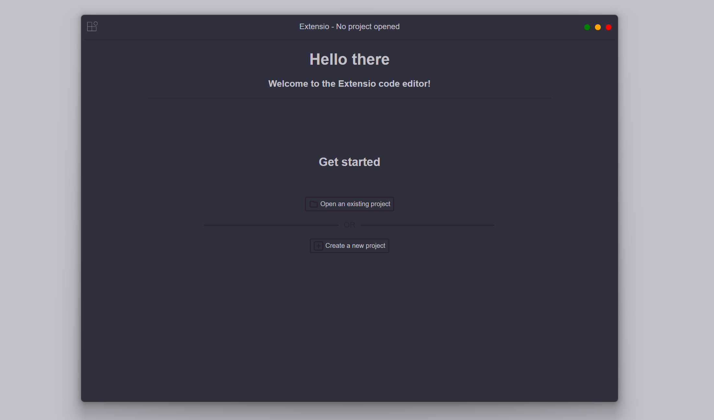

# Extensio

[](https://opensource.org/licenses/MPL-2.0)

[](https://github.com/extensio-editor/extensio/labels/bug)
[](https://discord.gg/3uhgsDzCse)




## Some commands for when you are developing
These are some commands that might be usefull when developing the extensio editor itself.

### Project setup
```
npm install
```

### Compiles and hot-reloads for development
```
npm run dev
```

### Compiles and minifies for production
```
npm run release
```

### Lints and fixes files
```
npm run lint
```
